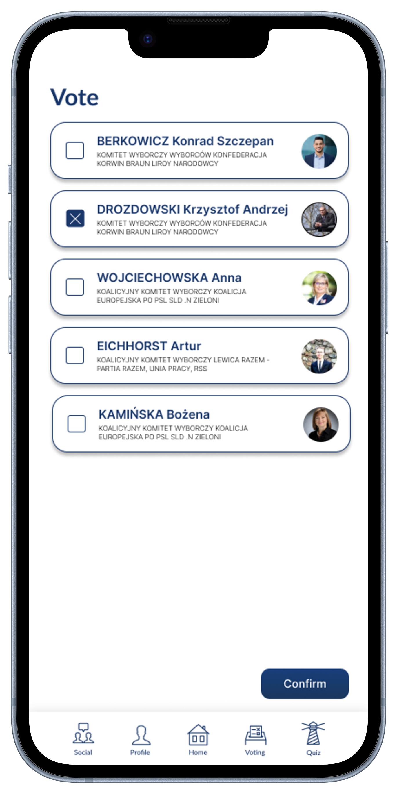

# eVote EU – Vote with us​
Our app introduces revolutionary innovations to each new election.   

  

With our app, the ability to **remotely cast votes** for candidates will be introduced. Are you a proponent of traditional voting? No problem. Based on our experience in Estonia where electronic voting is an everyday occurrence, we are introducing the principle that any physical vote will overwrite the vote cast online, so you can have no worries. To encourage people, prizes will be drawn among those who cast a vote.   

  

Not interested in politics, but would like to vote for a candidate who supports your views? With the **quiz** in our app, you can find out which party (including the European parties) best suits your values, and learn about which candidates are running from your district.   

  

Each of us knows that, unfortunately, school has not given us much knowledge about this important aspect of civic life. Wondering what the five percent is all about, why you can't find the candidate on your ballot for whom your friend from another city voted, and hearing about the D'Hondt method makes you sick? Thanks to our revolutionary app, you will learn about **all these intricacies** in a very accessible way today!   

 

Our application is also a **social medium** through which candidates can keep in touch with their potential voters. There they can send various posts describing their views on given situations, or create so-called AMAs (Ask me anything). Our main goal is to encourage voting, and nothing encourages people to vote more than seeing their friends and family at the ballot box. Our application will allow you to post that you have already cast your vote and inform your loved ones about it. 

